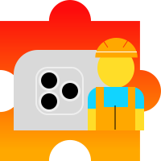

# Vision Camera Plugin Builder

<div align="center">
  <div style="padding: 30px">
    
  </div>
  <blockquote>Create <a href="https://github.com/mrousavy/react-native-vision-camera">Vision Camera</a> plugin native boilerplate in a few seconds</blockquote>
</div>

## 🤔 How it works

<div align="center">
  
</div>

#### Library use case

For `vision-camera-<pluginName>`, it generates:

- Android - inside Android source set:
  ```
  ├── android/src/main/<packageName>
  │   ├── <pluginName>
  │   ├──   ├── <pluginName>Plugin.(java|kt)
  │   ├── <pluginName>PluginPackage.(java|kt)
  ```
- iOS - inside iOS library's source code folder:
  ```
  ├── ios
  │   ├── <pluginName>
  │   ├──   ├── <pluginName>Plugin.(m|mm)
  │   ├──   ├── <pluginName>Plugin.Swift (if Swift selected)
  │   ├── <projectName>-Bridging-Header.h (if Swift selected & no bridging header specified)
  ```

#### Application use case

For local usage inside application, it generates:

- Android - inside Android source set:
  ```
  ├── android/src/main/<packageName>
  │   ├── <pluginName>
  │   ├──   ├── <pluginName>Plugin.(java|kt)
  │   ├──   ├── <pluginName>PluginPackage.(java|kt)
  ```
- iOS - inside iOS library's source code folder:
  ```
  ├── ios
  │   ├── <pluginName>
  │   ├──   ├── <pluginName>Plugin.(m|mm)
  │   ├──   ├── <pluginName>Plugin.Swift (if Swift selected)
  │   ├── <projectName>-Bridging-Header.h (if Swift selected & no bridging header specified)
  ```

## 🚀 Usage

> :warning: To generate ios boilerplate, you must first install [xcodeproj](https://github.com/CocoaPods/Xcodeproj) gem

```sh
npx vision-camera-plugin-builder ios
```

```sh
npx vision-camera-plugin-builder android
```

After generating native files, cli will output additional info like suggested JS setup, or Android package manual linking info

## ⚙️ Options

| Flag | Input | Description |
| ---- | ----- | ----------- |
| --projectPath (iOS only) | [string] | Path to .xcodeproj file |
| --manifestPath (Android only) | [string] | Path to project's Android Manifest file |
| --pluginName | [string] | Name of the plugin |
| --methodName | [string] | Name of plugin's exported method |
| --lang | [choices] | "Kotlin" or "Java" for Android & "Swift" or "ObjC" or "ObjCPP" for iOS |

## License

MIT
